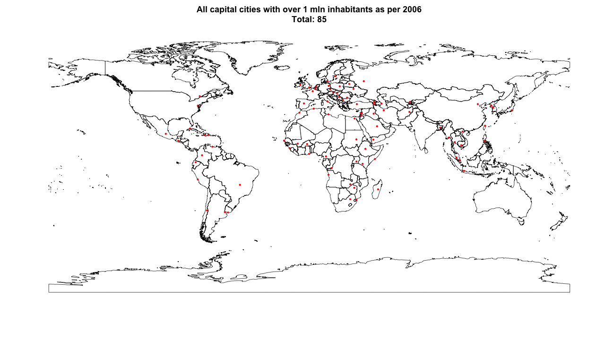
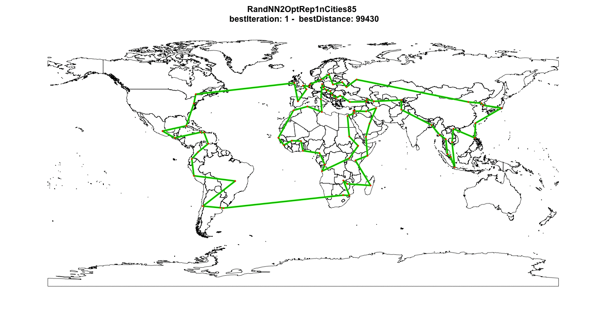
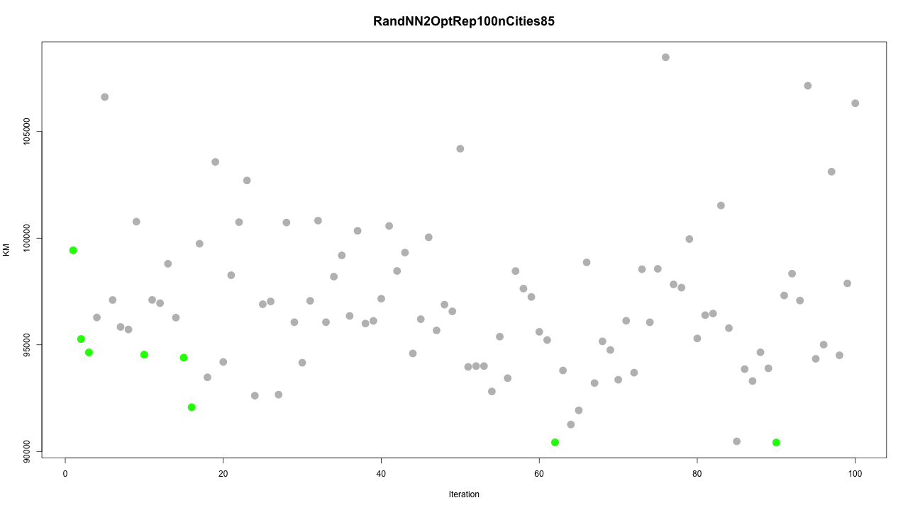

# Around the world in 90.414 kilometers

## The shortest route to visit all capital cities with over 1 mln inhabitants
This paper compares several search algorithms (i.e search heuristics) applied to a Traveling Salesman Problem of 85 cities. The goal is to show intuition behind some well known and effective search algorithms to people new to the subject of optimization. I chose to build less complex algorithms and attempted to describe them as understandably as possible. If you are interested you can run them yourself using the supplied R code or create your own adaptation. 

## Traveling Salesman Problem
Given a collection of cities and the cost of travel between each pair of them, the traveling salesman problem (TSP) is to find the cheapest way of visiting all of the cities and returning to the starting point. The simplicity of the statement of the problem is deceptive; the TSP is one of the most intensely studied problems in computational mathematics ([source](http://www.math.uwaterloo.ca/tsp/problem/index.html)). For this project 'cost' is defined as the direct (i.e Euclidean) distance in KM between two cities.

## Dataset
The 85 cities that need to be visited are all the capital cities around the world with over 1 mln inhabitants as per 2006. Today there might me more capital cities with over 1 mln people, but that is not relevant to the optimization problem itself. I made an exception for the capitals of the US (Washington), Canada (Ottawa) and the Netherlands (Amsterdam). They did not have more than 1 mln inhabitants in 2006, but I added them anyway just for fun. The dataset is build from a source file that is freely available in the 'maps' package in R and has information on over 40.000 cities. Of course, we start all our routes in Amsterdam.

## Approach
One approach could be to calculate all possible routes and choose the optimal one. For this instance of TSP with 85 cities the number of possible solutions is 1.65712e+126, or 1657120067282643529694317127122958783813299277197483101064623714896696398713440263618419048770174788491009133122012443658158080 routes ([formula](http://www.math.uwaterloo.ca/tsp/problem/pcb3cnt.html)). This is more than the number of stars in the universe ([source](https://www.esa.int/Our_Activities/Space_Science/Herschel/How_many_stars_are_there_in_the_Universe)), or the number of grains of sand in the Sahara ([source](https://www.youtube.com/watch?v=jQ41Gk80djs)). It would take many years and a quantum computer to solve the problem using this approach. Since I don't have either at my disposal this approach is not feasible. 

Another approach could be to use exact algorithms like branch-and-bound or simplex. These are very robust methods that will find the optimum solution for TSP problems of up to +/-200 (on the average PC). However, visualising these in an intuitive way is challenging, if not impossible. As the main goal of this project is to show intuition of algorithms to people who are fresh on the subject, these are not suitable. Also, these methods do not scale well so applying them to more cities (the source file contains 40.000 in total) is not feasible. Hence, less opportunity to play around with larger sets.

Instead, I used another powerful line of attack to this problem: search heuristics. The advantage of these methods is that you can keep them relatively simple and intuitive, while they can still find solutions that are (close to) the optimum. Also, they scale better so applying them to a larger TSP will less likely crash your machine. A disadvantage is that you will not know how far you are from the optimum. The search heuristics I used are Nearest Neighbours, Randomized Nearest Neighbours and (repeated) 2-Opt. As I will show you, these are relatively simple but also very effective and intuitive, especially when applied in combination. 

## Nearest Neighbours
Nearest Neighours (NN) is one of the simplest search heuristics out there. It is part of the family of constructive search heuristics, meaning that it gradually builds a route. Starting with one city and stopping only when all cities have been visited. It is greedy in nature; at each step it chooses the location that is closest to the current location. 

Applied to our problem we find a route with a total distance of 112.881 KM. Every time we run the algorithm, it will generate exactly the same solution. This might seem reassuring, but it is also a big downside of this algorithm. Because of its greedy nature, it will always go for immediate gains and miss out on opportunities that will pay out in a longer term. NN has given us a feasible solution that does not look bad at all for a first try. But can we further improve on it?
## Nearest Neighbours with 2-Opt
2-Opt is an algorithm from the local search family. These algorithms start at an initial solution and iteratively look for improvement opportunities in the neighourhood of that solution. This initial solution can be any type of solution as long as it is a feasible one. For example the outcome of a constructive algorithm like NN or a solution build from expert knowledge. 

The 2-opt algorithm works as follows: take 2 arcs from the route, reconnect these arcs with each other and calculate new travel distance. If this modification has led to a shorter total travel distance the current route is updated. The algorithm continues to build on the improved route and repeats the steps. This process is repeated until no more improvements are found or until a pre-specified number of iterations is completed (100 in this implementation). 

For example, let us take the following route: Amsterdam - Brussels - Paris - Berlin - Copenhagen - Helsinki - London - Amsterdam. One arch could be Brussel-Paris, another could be Copenhagen-Helsinki. 2-Opt exchanges the connections in these arches, i.e. the route now runs from Brussel-Copenhagen and from Paris-Helsinki.

* Current route: Amsterdam - Brussels - Paris - Berlin - Copenhagen - Helsinki - London - Amsterdam
* Modified route: Amsterdam - Brussels - Copenhagen - Berlin - Paris - Helsinki - London - Amsterdam

For convenience, this visualisation shows just one iteration (i.e. the Amsterdam-Brussels arc), but there could be up to 700.000 of these iterations in my implementation. Hence, for a small instance the final solution could look quite different from the initial solution. The final solution found by NN + 2-Opt is 99.242 KM. Hurray! We improved our tour!
## Randomized Nearest Neighbours
Altough 2-Opt was able to improve our tour, the initial downside of NN extension still exists. We might still be improving a local optimum solution only, while never being able to capitalize on the big long term improvement opportunities. To increase our chance of 'stumbling' upon one of those big improvement opportunities, we will need to diversify our initial starting solutions. This means that we might propose initial solutions that might look 'dumb' initially, but actually are the building block for something great. 

This is where the Randomized Nearest Neighbours algorithm (RNN, not to be mistaken with Recurrent Neural Network) comes in play. The only difference with the regular NN algorithm is that it is not completely 'greedy', since at every step in building the route it considers multiple candidates (the 3 shortest distance options in my implementation) and randomly chooses 1. You can adjust 'greediness' of the algorithm by increasing or decreasing the number of candidates. A less greedy algorithm will produce more variance in the generates routes.

The final solution when applied to our problem has almost double the travel distance, 194.936 KM, and also the plot looks very messy. But wait! Don't throw your computer out of the window just yet. This might just be bad luck due to the randomness in our algorithm (i.e. its stochastic nature). Or we might be very lucky and it might prove to be an excellent building block for local search... Lets investigate!

## Randomized Nearest Neighbours with 2-Opt
Next, we apply 2-Opt to the final solution from RNN to see if in fact it is a genius building block disguised as a monstrosity.

Yes!!! 2-Opt took this ugly thing we started out with and turned it into a beautiful new route of just 99.430 KM. It almost seems like a fairy tale... But wait, lets not yet hit the bars to celebrate. The route is slightly longer then the route from NN + 2Opt so we have some more work to do.

The random outcome of our RNN has given us a decent building block to work with. But what if there are even better building blocks out there? Due to the stochastic nature every repetition of this process produces a different outcome, i.e. a different route to start with. What if we repeat this process many times? Maybe we will stumble upon an even better building block!

## Repeated Randomized Nearest Neighbours with 2-Opt
This algorithm runs the RNN algorithm many times and applies 2-Opt to each outcome. By repeating this process over and over we are exploring the neigbourhood of many different starting solutions. Doing this we greatly expand out search area and we have a better chance of finding local and global optima. In my implementation I am repeating the process 100 times to ensure the GIF does not become too large.

Wow! Applying this combination of algorithms has decreased our current best total travel distance by a whopping 10%! Total travel distance is now 90.414 KM. Now its really time to celebrate. This algorithm has been able to find 8 improvements on our previous best route. By introducing variance in the explored initial solutions we where able to explore a lot of different solutions and improve on them iteratively. Doing this we where able to cover a lot of ground, and also explore initial solutions that looked less promising at start. The algorithm went from something very static, greedy and without inspiration to something that is able to investigate many options and generate creative solutions to the problem. 

The last improvement was found in the 95th iteration, so it might be worthwhile to extend the number of iterations in a next run.  

## Conclusion
Optimization problems can appear to be simple, but in fact are often very complex and have an enormous number of potential solutions. Solving them can be done with exact methods, but those often require time and a lot of computing power and especially larger optimization problems will often be to complex to solve. But, applying common sense and some creativity we can build algorithms that require less processing power and can perform very well. In fact, these solutions can even outperform the exact methods if time is a constraint. I hope this paper helps people unfamiliar with optimization create some intuition in how algorithms can work and get a sense of their massive potential. 

Algorithm | Solution
------------ | -------------
Nearest Neighbours | 112.881 KM
Nearest Neighbours with 2-Opt | 99.242 KM
Randomized Nearest Neighbours | 194.936 KM
Randomized Nearest Neighbours with 2-Opt | 99.430 KM
Repeated Randomized Nearest Neighbours with 2-Opt | 90.414 KM

Let me know if you where able to find an even better solution!

Mikko Venhuis

Email: mikkovenhuis@gmail.com

### Things I did not have time for but are on my to-do list
* Generate the optimal solution to this problem using Gurobi
* Make regional versions. E.g. visit all capital cities in Europe
* Apply alternative search heuristics like Genetic Algorithm, Simulated Annealing or Tabu Search

### If you would like to know more:
* Traveling Sales Problem: [wiki](https://en.wikipedia.org/wiki/Travelling_salesman_problem) or [University of Waterloo](http://www.math.uwaterloo.ca/tsp/)
* 2-Opt: [wiki](https://en.wikipedia.org/wiki/2-opt)
* Nearest Neighbours: [wiki](https://en.wikipedia.org/wiki/Nearest_neighbour_algorithm)
