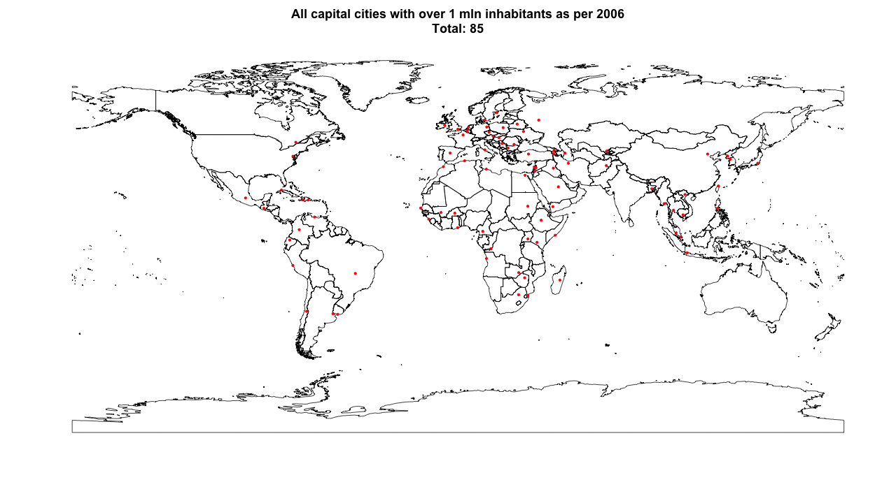
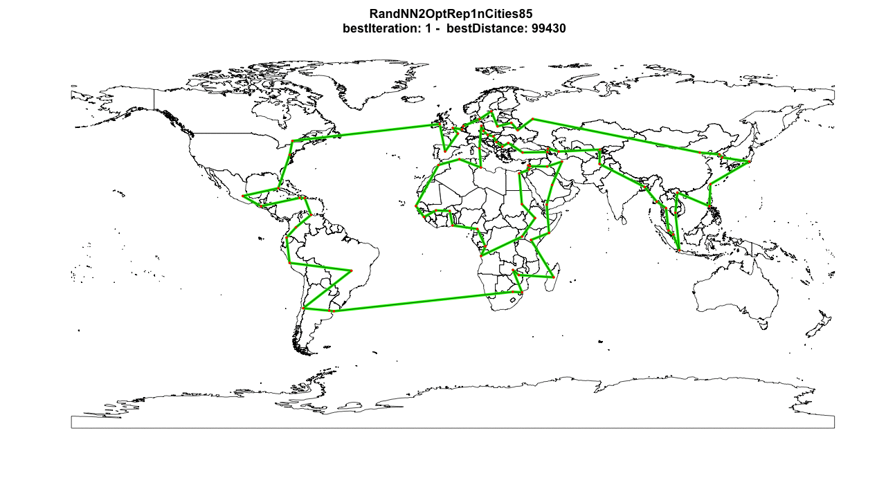

# Around the world in 90414 kilometers
## The fastest route to visit all capital cities with over 1 mln inhabitants
This project compares several search heuristics applied to a Traveling Salesman Problem with 85 points. The goal of this project is to show intuition behind some well known and effective search heuristics to people new to the subject of optimization. If you are interested you can run the algoritms yourself using the supplied R code or create your own adaptation. 

## Traveling Salesman Problem
Given a collection of cities and the cost of travel between each pair of them, the traveling salesman problem, or TSP for short, is to find the cheapest way of visiting all of the cities and returning to your starting point. The simplicity of the statement of the problem is deceptive -- the TSP is one of the most intensely studied problems in computational mathematics and yet no effective solution method is known for the general case ([source](http://www.math.uwaterloo.ca/tsp/problem/index.html)). For this project cost is defined as the direct (i.e Euclidian) distance between two points.

## Dataset
The dataset contains all the capital cities around the world with over 1 mln inhabitants as per 2006. Nowawadays, there might me more capital cities with over 1 mln people, but that is not relevant to the optimization problem itself. I made an exception for the capitals of the US (Washington), Canada (Ottawa) and the Netherlands (Amsterdam). They did not have more than 1 mln inhabitants, but I added them just for fun. The set contains data on a total of 85 cities. The dataset is freely available in the 'maps' package in R and has information on over 40.000 cities. The city where I start all routes Amsterdam.

## Approach
One approach could be to calculate all possible routes and choose the optimal one. For this instance of TSP with 85 cities the number of possible solutions can be calculated as (n-1)!/2 which translates to 1.65712e+126, or 1657120067282643529694317127122958783813299277197483101064623714896696398713440263618419048770174788491009133122012443658158080 routes. It would take many years and a quantum computer to solve the problem using this approach. Since I don't have either at my disposal this approach is not feasible. 

Another approach could be to use exact algoritms like branch-and-bound or simplex. These are very robust methods that will find the optimum solution for TSP problems of up to +/-200 (on the average PC). However, visualising these in an intuitive way is challenging, if not impossible. As the main goal of this project is to show intuition of algoritms to people who are fresh on the subject, these are not suitable. Also, these methods do not scale well so applying them to more cities (the dataset contains 40000 in total) is not feasible. Hence, less opportunity to play around with larger sets.

Instead, I will use another powerfull line of attack to this problem: search heuristics. The advantage of these methods is that you can keep them relatively simpel and intuitive, while they are still able to find solutions that are (close to) the optimum. Also, they scale better so applying them to a 500 city TSP will less likely crash your machine. A disadvantage is that you will not know how far you are from the optimimum. The search heursistics I used include Nearest Neighbours, Randomized Nearest Neighbours and (repeated) 2-Opt. As I will show you, these are relatively simple but also very effective and intuitive, especially when applied in combination. 

## Nearest Neighbour
Nearest Neighour (NN) is one of the simplest search heuristics out there. It is part of the family of constructive search heuristics, meaning that it gradually builds a route, starting with 1 city and stopping only when all cities have been visited. It is greedy in nature; at each step it chooses the location that is closest to the current location. Applied to our problem it finds a route with a total distance of 112.881 KM. Everytime we run the algoritm, it will generate exactly the same solution. This might seem reassuring, but it is also a big downside of this algoritm. Because of its greedy nature, it will always go for immediate gains and miss out on opportunities that will pay out in a longer term. NN has given us a feasible solution that does not look bad at all for a first try. But can we improve further on it?

## Nearest Neighbors with 2-Opt
2-Opt is an algoritm from the local search family. These algoritms generate a final solution by starting at an initial and  solution and iteratively looking for improvement opportunities in the neighourhood of that solution. This initial solution can be any type of solution as long as it is a feasible one. For example the outcome of a constructive algoritm or a solution build from expert knowledge. The implementation of this 2-opt algoritm works as follows: take 2 arcs from the route and reconnect these arcs with each other. If this modification has led to a shorter total travel time, the route is modified. The algoritm continues to build on the improved route. This process can be repeated until no more improvements are found or untill a pre-specified number of iterations are completed (100 in this implementation). 

For example, let us take the following route: Amsterdam - Brussels - Paris - Berlin - Copenhagen - Helsinki - London - Amsterdam. One arch could be Brussel-Paris, another could be Copenhagen-Helsinki. 2-Opt exchanges the connections in these arches, i.e. the route now runs from Brussel-Copenhagen and from Paris-Helsinki. Next, new travel distance is calculated and compared with the old one. In case of improvement, the new route is accepted and taken as new starting point. 

Old route: Amsterdam - Brussels - Paris - Berlin - Copenhagen - Helsinki - London - Amsterdam

New route: Amsterdam - Brussels - Copenhagen - Berlin - Paris - Helsinki - London - Amsterdam

Below GIF shows the intuition of this algoritm. The visualisation shows just 1 iteration (i.e. the London-Amsterdam arc), but there could be up to 700.000 of these iterations in the current set-up. Hence, for small instanced the final solution could look drastically different from the initial solution. The final solution found by NN + 2-Opt is 99.242 KM. Hurray! We improved our tour!

 
## Randomized Nearest Neighbours
Altough 2-Opt was able to improve our tour, the initial downside of NN extension still exists. We might still be improving  a local optimum solution solution, while never being able to capitalize on the big long term improvement opportunities. To increase our chances of 'stumbling' upon one of those big improvement opportunities, we will need to diversify our initial starting solutions. We need to propose initial solutions that might look 'dumb' initially, but might actually be the building block for something great. This is where the Randomized Nearest Neighbours (RNN, not to be mistaken with Recurrent Neural Network) algoritm comes in play. The only difference with the regular NN algoritm is that it is not completely 'greedy', since at every step in building the route it considers multiple candidates (the 3 shortest distances my implementation) and randomly chooses 1. You can adjust 'greediness' of the algoritm by increasing the number of candidates.

The final solution when applied to our problem is 194.936 and also the plot looks very messy. But wait! Don't throw your computer out of the window just jet. This might just be bad luck due to the randomness in our algoritm (i.e. stochastic nature). Or we might be very lucki and it might prove to be an excellent building block for local search... Lets investigate!

## Randomized Nearest Neighbours with 2-Opt
Next, we apply 2-Opt to the final solution from RNN to see if in fact it is a genius building block disguised as a monstrosity.

Yes!!! 2-Opt took this ugly thing we started out with and has turned it into a beatifull new and improved route! It almost seems like a fairytale... But wait, lets not yet hit the bars to celebrate. What if we could improve our route even further? The random outcome of our RNN has given us a decent building block to work with. But what if there are even better building blocks out there? Due to the stochastic nature of the process every repetition of this process will gives a different outcome, i.e. a different route to start with. What if we repeat this process many times? Maybe we will stumble upon an even better building block!

## Repeated Randomized Nearest Neighbours with 2-Opt
This algoritm runs the RNN algoritm many times and applies 2-Opt to each outcome. By repeating this process over and over we are exploring the neigbourhood of many different starting solutions. Doing this we greatly expand out searching area and we have a bigger chance of finding local and global optima. In this implementation I am repeating the process 100 times. 

Wow! Applying this combination of algoritms as decreased total distance traveled by a whopping 10%! Total travel distance is not 90.414 KM. Now its really time to celebrate. This algoritm has been able to find 7 improvements in our previous best route. By introducing variance in the explored intial solutions we where able to explore a lot of different solutions and improve on them iteratively. Doing this we where able to cover a lot of ground, and also explore initial solutions that looked less promising at start. The algoritm went from something very static, without inspiration and creativity to something that is able to learn and improve by itself and show creativity in the process. 

## Conclusion
Optimization problems can appear to be simple, but in fact are often very complex and have a enormous amount of potential solutions. Solving them can be done with exact methods, but those often require time and a lot of computing power. Especially large optimization problems will often be too difficult to deal with, despite all the process we are making in terms of affordable computing power (i.e. Moore' s law). But, applying common sense and some creativity, we can still build algoritms that can perform very well. In fact, these solutions can even outperform the exact methods if time is a constraint. I hope this paper helps people unfamiliar with optimization create some intuition in how algoritms can work and get a sense of their massive potential. 

### Things I did not have time for but are on my to-do list
- Generate the optimal solution to this problem using the Gurobi
- Make regional versions. E.g. visit all capital cities in Europe
- Apply alternate search heuristics, like Genetic Algoritm, Simulated Annealing or Tabu Search

### If you would like to know more:
- Traveling Sales Problem https://en.wikipedia.org/wiki/Travelling_salesman_problem

